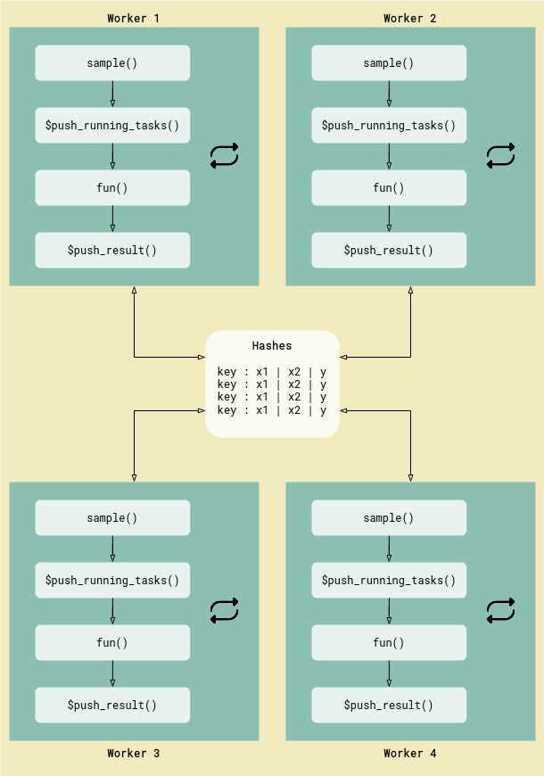

<!-- README.md is generated from README.Rmd. Please edit that file -->

# rush

*rush* is a package for parallel and distributed computing in R. It
evaluates an R expression asynchronously on a cluster of workers and
provides a shared storage between the workers. The shared storage is a
[Redis](https://redis.io) data base. Rush offers a centralized and
decentralized network architecture. The centralized network has a single
controller (`Rush`) and multiple workers (`RushWorker`). Tasks are
created centrally and distributed to workers by the controller. The
decentralized network has no controller. The workers sample tasks and
communicate the results asynchronously with other workers.

# Features

-   Parallelize arbitrary R expressions.
-   Centralized and decentralized network architecture.
-   Small overhead of a few milliseconds per task.
-   Easy start of local workers with `processx`
-   Start workers on any platform with a batch script.
-   Designed to work with
    [`data.table`](https://CRAN.R-project.org/package=data.table).
-   Results are cached in the R session to minimize read and write
    operations.
-   Detect and recover from worker failures.
-   Start heartbeats to monitor workers on remote machines.
-   Snapshot the in-memory data base to disk.
-   Store [`lgr`](https://CRAN.R-project.org/package=lgr) messages of
    the workers in the Redis data base.
-   Light on dependencies.

## Install

Install the development version from GitHub.

``` r
remotes::install_github("mlr-org/rush")
```

And install
[Redis](https://redis.io/docs/latest/operate/oss_and_stack/install/install-stack/).

## Centralized Rush Network


*Centralized network with a single controller and three workers.*

The example below shows the evaluation of a simple function in a
centralized network. The `network_id` identifies the instance and
workers in the network. The `config` is a list of parameters for the
connection to Redis.

``` r
library(rush)

config = redux::redis_config()
rush = Rush$new(network_id = "test", config)

rush
```

    ## <Rush>
    ## * Running Workers: 0
    ## * Queued Tasks: 0
    ## * Queued Priority Tasks: 0
    ## * Running Tasks: 0
    ## * Finished Tasks: 0
    ## * Failed Tasks: 0

Next, we define a function that we want to evaluate on the workers.

``` r
fun = function(x1, x2, ...) {
  list(y = x1 + x2)
}
```

We start two workers.

``` r
rush$start_local_workers(fun = fun, n_workers = 2)
```

    ## INFO  [17:30:43.422] [rush] Starting 2 worker(s)
    ## $`d82afa87-9f2c-41a4-891c-7490ea5eba46`
    ## PROCESS 'Rscript', running, pid 24531.
    ## 
    ## $`fad19573-bfe6-4809-8be2-bdde44191210`
    ## PROCESS 'Rscript', running, pid 24542.

Now we can push tasks to the workers.

``` r
xss = list(list(x1 = 3, x2 = 5), list(x1 = 4, x2 = 6))
keys = rush$push_tasks(xss)
rush$wait_for_tasks(keys)
```

And retrieve the results.

``` r
rush$fetch_finished_tasks()
```

    ##       x1    x2     y   pid     worker_id          keys
    ##    <num> <num> <num> <int>        <char>        <char>
    ## 1:     3     5     8 24542 fad19573-b... 7ac77ca4-6...
    ## 2:     4     6    10 24531 d82afa87-9... 0fb60722-6...

## Decentralized Rush Network



*Decentralized network with four workers.*
