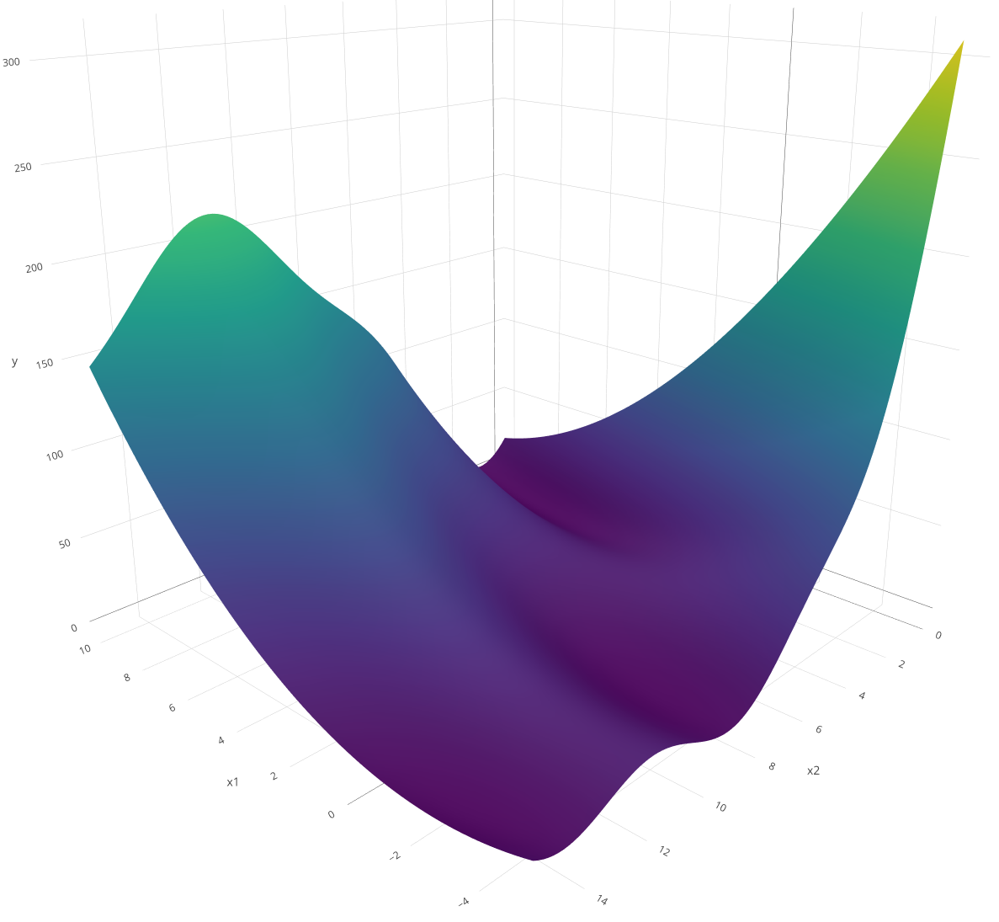

# rush - Asynchronous and Distributed Computing

*rush* is a package designed to solve large-scale problems
asynchronously across a distributed network. Employing a database
centric model, rush enables workers to communicate tasks and their
results over a shared [`Redis`](https://redis.io/) database. This
article demonstrates how to use `rush` with 3 different examples.

## Random Search

We begin with a simple random search to optimize the Branin function in
parallel. Although random search does not require communication between
workers, it is a good way to introduce the basic ideas behind `rush`.
The classic Branin function (also called the Branin-Hoo function) is a
well-known benchmark problem in global optimization. It is a
two-dimensional function that is non-convex, multimodal, and has three
global minima. The function is a toy example for optimization thats fast
to evaluate but not too simple to be solved.

``` r
branin = function(x1, x2) {
  (x2 - 5.1 / (4 * pi^2) * x1^2 + 5 / pi * x1 - 6)^2 + 10 * (1 - 1 / (8 * pi)) * cos(x1) + 10
}
```

The Branin function is usually evaluated on the domain \\x_1 \in \[-5,
10\]\\ and \\x_2 \in \[0, 15\]\\.



### Worker Loop

We define the `worker_loop` function, which runs on each worker. It
repeatedly draws tasks, evaluates them, and sends the results to the
Redis database. The function takes a single argument: a `RushWorker`
object, which handles communication with Redis. In this example, each
worker samples a random point, creates a task, evaluates it using the
Branin function, and submits the result. The optimization stops after
100 tasks have been evaluated.

``` r
wl_random_search = function(rush) {

  while(rush$n_finished_tasks < 100) {

    xs = list(x1 = runif(1, -5, 10), x2 = runif(1, 0, 15))
    key = rush$push_running_tasks(xss = list(xs))

    ys = list(y = branin(xs$x1, xs$x2))
    rush$push_results(key, yss = list(ys))
  }
}
```

The most important methods of the `RushWorker` are the
`$push_running_tasks()` and `$push_results()` methods. The first method
`$push_running_tasks()` creates a new task in the Redis database. Since
it is evaluated next, the task is marked as running. The
`$push_running_tasks()` method returns a unique key that is used to
identify the task. The second method `$push_results()` is used to push
the results back to the Redis database. It takes the key of the task and
a list of results. To mark the task as running is not important for a
random search, but it is crucial for more sophisticated algorithms that
use the tasks of other workers to decide which task to evaluate next.
For example, Bayesian optimization algorithms would sample the next
point further away from the previous points to explore the search space.
The `$n_finished_tasks` shows how many tasks are finished and is used to
stop the worker loop.

### Tasks

Tasks are the unit in which workers exchange information. The main
components of a task are the key, computational state, input (`xs`), and
result (`ys`). The key is a unique identifier for the task. It
identifies the task in the Redis database. The four possible
computational states are `"running"`, `"finished"`, `"failed"`, and
`"queued"`. The `$push_running_tasks()` method marks it as `"running"`
and returns the key of the task. The `$push_results()` method marks a
task as `"finished"` and stores the result. Failed tasks can be marked
as `"failed"` with the `$push_failed()` method. The error catching must
be implemented in the worker loop (see [Error
Handling](https://rush.mlr-org.com/articles/error_handling.md) for more
details). Tasks can also be pushed to a queue with the `$push_tasks()`
method which sets the state to `"queued"`. The last example gives more
details on the task queue and the different methods to push and pop
tasks. The input `xs` and result `ys` are lists that can contain
arbitrary data. Usually the methods of the `RushWorker` work on multiple
tasks at once, so `xxs` and `yss` are lists of inputs and results.

### Controller

The Rush controller is responsible for starting, observing, and stopping
workers within the network. It is initialized using the
[`rsh()`](https://rush.mlr-org.com/reference/rsh.md) function, which
requires a network ID and a config argument. The config argument is a
configuration file used to connect to the Redis database via the `redux`
package.

``` r
library(rush)

config = redux::redis_config()

rush = rsh(
  network = "test-random-search",
  config = config)
```

Workers can be started using the `$start_local_workers()` method, which
accepts the worker loop and the number of workers as arguments. The
workers are started locally with the `processx` package but it is also
possible to start workers on a remote machine (see [Rush
Controller](https://rush.mlr-org.com/articles/rush_controller.md)). We
need to export the `branin` function to the workers, so we set the
`globals` argument to `"branin"`. More on globals and the different
worker types can be found in the [Rush
Controller](https://rush.mlr-org.com/articles/rush_controller.md)
vignette.

``` r
rush$start_local_workers(
  worker_loop = wl_random_search,
  n_workers = 4,
  globals = "branin")

rush
```

    <Rush>
    * Running Workers: 0
    * Queued Tasks: 0
    * Queued Priority Tasks: 0
    * Running Tasks: 0
    * Finished Tasks: 0
    * Failed Tasks: 0

The optimization is quickly finished and we retrieve the results. The
`$fetch_finished_tasks()` method fetches all finished tasks from the
database. The method returns a `data.table()` with the key, input, and
result. The `pid` and `worker_id` column are additional information that
are stored when the task is created. The `worker_id` is the id of the
worker that evaluated the task and the `pid` is the process id of that
worker. Further extra information can be passed as `list`s to the
`$push_running_tasks()` and `$push_results()` methods via the `extra`
argument.

``` r
rush$fetch_finished_tasks()[order(y)]
```

                x1         x2           y   pid     worker_id          keys
             <num>      <num>       <num> <int>        <char>        <char>
      1:  3.477268  2.2650660   0.9901065 12428 inconseque... 54b8738f-3...
      2:  3.502803  2.6687294   1.4512257 12448 piecemeal_... ae6bca55-c...
      3:  4.042130  1.7160029   4.0367571 12428 inconseque... 1c3237ba-1...
      4:  3.800528  0.5028386   4.1357267 12439 carbonaceo... 2c80cd37-f...
      5: -4.056844 13.4290685   5.4776957 12428 inconseque... fe9e383b-6...
     ---
     99:  3.271289 14.7904817 159.6029664 12428 inconseque... 8d367119-f...
    100:  8.986640 14.7968538 161.7484887 12448 piecemeal_... b7d3944c-f...
    101:  9.043105 14.9249383 163.7295778 12448 piecemeal_... f3bf402a-e...
    102:  5.797529 14.6892901 202.7528628 12428 inconseque... b393c15b-c...
    103: -4.870316  0.3978545 281.0526278 12428 inconseque... e36cf733-8...

The rush controller displays how many workers are running and how many
tasks exist in each state. In this case, 103 tasks are marked as
finished, and all workers have stopped. The number slightly exceeds 100
because workers check the stopping condition independently. If several
workers evaluate the condition around the same time — when, for example,
99 tasks are finished — they may all create new tasks before detecting
that the limit has been reached. Additionally, tasks may continue to be
created while the 100th task is still being evaluated.

``` r
rush
```

    <Rush>
    * Running Workers: 0
    * Queued Tasks: 0
    * Queued Priority Tasks: 0
    * Running Tasks: 0
    * Finished Tasks: 103
    * Failed Tasks: 0

We can stop the workers and reset the database with the `$reset()`
method.

``` r
rush$reset()

rush
```

    <Rush>
    * Running Workers: 0
    * Queued Tasks: 0
    * Queued Priority Tasks: 0
    * Running Tasks: 0
    * Finished Tasks: 0
    * Failed Tasks: 0

To learn more about starting, stopping and observing workers, see the
[Rush Controller](https://rush.mlr-org.com/articles/rush_controller.md)
vignette.

## Median Stopping

Random search is a simple example that doesn’t rely on information from
previous tasks and therefore doesn’t require communication between
workers. Now, let’s implement a more sophisticated algorithm that uses
the results of completed tasks to decide whether to continue evaluating
the current one. We tune an XGBoost model on the mtcars dataset and use
the median stopping rule to stop the training early.

### Worker Loop

The worker starts by sampling a random hyperparameter configuration with
three parameters: maximum tree depth, lambda regularization, and alpha
regularization. These parameters control how the XGBoost model learns
from the data. The worker then trains the model incrementally, starting
with 5 boosting rounds and adding one round at a time up to 20 rounds.
After each round, the worker evaluates the model’s performance on a test
set using root mean squared error (RMSE). At this point, the worker
checks how well its model is doing compared to other workers by fetching
their completed results and comparing its performance to the median
score among all models with the same number of training rounds.

If the current model performs worse than the median, the worker stops
this hyperparameter configuration and starts over with a new one. This
early stopping mechanism prevents workers from wasting time on
poor-performing configurations. If the model performs at or above the
median, the worker continues training for one more round. The process
continues until the network has evaluated 1000 complete models across
all workers.

``` r
wl_median_stopping = function(rush) {
  while(rush$n_finished_tasks < 1000) {

    params = list(
      max_depth = sample(1:20, 1),
      lambda = runif(1, 0, 1),
      alpha = runif(1, 0, 1)
    )

    model = NULL
    for (iteration in seq(5, 20, by = 1)) {

      key = rush$push_running_tasks(xss = list(c(params, list(nrounds = iteration))))

      model = xgboost(
        data = as.matrix(data[training_ids, ]),
        label = y[training_ids],
        nrounds = if (is.null(model)) 5 else 1,
        params = params,
        xgb_model = model,
        verbose = 0
      )

      pred = predict(model, as.matrix(data[test_ids, ]))
      rmse = sqrt(mean((pred - y[test_ids])^2))

      rush$push_results(key, yss = list(list(rmse = rmse)))

      tasks = rush$fetch_finished_tasks()
      if (rmse > median(tasks[nrounds == iteration, rmse])) break
    }
  }
}
```

The worker loop uses a new method called `$fetch_finished_tasks()` to
fetch all finished tasks from the database. Other methods like
`$fetch_running_tasks()` and `$fetch_failed_tasks()` are also available.

We sample a training and test set from the mtcars dataset. The training
set is used to fit the model and the test set is used to evaluate the
model. Then we initialize the rush network and start the workers. This
time we have to pass the training and test set to the workers via the
`globals` argument and the `packages` argument to load the `data.table`
and `xgboost` packages.

``` r
data(mtcars)

training_ids = sample(1:nrow(mtcars), 20)
test_ids = setdiff(1:nrow(mtcars), training_ids)
data = mtcars[, -1]
y = mtcars$mpg

config = redux::redis_config()

rush = rsh(
  network = "test-median-stopping",
  config = config)

rush$start_local_workers(
  worker_loop = wl_median_stopping,
  n_workers = 4,
  packages = c("data.table", "xgboost"),
  globals = c("training_ids", "test_ids", "data", "y"))
```

We fetch the finished tasks and sort them by the objective value.

``` r
rush$fetch_finished_tasks()[order(y)]
```

    Null data.table (0 rows and 0 cols)

We stop the workers and reset the database.ch

``` r
rush$reset()
```

## Bayesian Optimization

We implement Asynchronous Distributed Bayesian Optimization (ADBO)
\[@egele_2023\] next. This example shows how workers use information
about running tasks and introduces task queues. ADBO runs sequential
[Bayesian
optimization](https://mlr3book.mlr-org.com/chapters/chapter5/advanced_tuning_methods_and_black_box_optimization.html#sec-bayesian-optimization)
on multiple workers in parallel. Each worker maintains its own surrogate
model (a random forest) and selects the next hyperparameter
configuration by maximizing the upper confidence bounds acquisition
function. To promote a varying exploration-exploitation tradeoff between
the workers, the acquisition functions are initialized with different
lambda values ranging from 0.1 to 10. When a worker completes an
evaluation, it asynchronously sends the result to its peers via a Redis
data base; each worker then updates its local model with this shared
information. This decentralized design enables workers to proceed
independently; eliminating the need for a central coordinator that could
become a bottleneck in large-scale optimization scenarios.

We first create a new rush network.

``` r
config = redux::redis_config()

rush = rsh(
  network = "test-bayesian-optimization",
  config = config)
```

### Queues

The queue system works by pushing and popping tasks from a queue. The
`$push_task()` method creates new tasks and pushes them to the queue. In
this example, we draw an initial design of 25 points and push them to
the queue.

``` r
xss = replicate(25, list(x1 = runif(1, -5, 10), x2 = runif(1, 0, 15)), simplify = FALSE)

rush$push_tasks(xss = xss)

rush
```

    <Rush>
    * Running Workers: 0
    * Queued Tasks: 25
    * Queued Priority Tasks: 0
    * Running Tasks: 0
    * Finished Tasks: 0
    * Failed Tasks: 0

We see 25 queued tasks in the database. To retrieve the tasks from the
queue, we need to implement the `$pop_task()` method in the worker loop.

### Worker Loop

The worker loop pops tasks with the `$pop_task()` method from the queue.
The task is evaluated and the results are pushed back to the database
with the `$push_results()` method. If there are no more tasks in the
queue, the `$pop_task()` method returns `NULL` and the worker loop
starts the Bayesian optimization. First, a lambda value for the
acquisition function is sampled between 0.01 and 10. Then all running
and finished tasks are fetched from the database. Using
`rush$fetch_tasks_with_state()` instead of using
`$fetch_running_tasks()` and `$fetch_finished_tasks()` is important
because it prevents tasks from appearing twice. This could be the case
if a worker changes the state of a task from `"running"` to `"finished"`
while the tasks are being fetched. The missing y values of the running
tasks are imputed with the mean of the finished tasks. Then the
surrogate random forest model is fitted to the data and the acquisition
function is optimized to find the next task. Marking the task as running
is important for the Bayesian optimization algorithm, as it uses the
already sampled points of the other workers to decide which task to
evaluate next. The task is evaluated and the results are pushed back to
the database. We stop the optimization process after 100 evaluated
tasks.

``` r
wl_bayesian_optimization = function(rush) {
  repeat {
    task = rush$pop_task()
    if (is.null(task)) break
    ys = list(y = branin(task$xs$x1, task$xs$x2))
    rush$push_results(task$key, yss = list(ys))
  }

  lambda = runif(1, 0.01, 10)

  while(rush$n_finished_tasks < 100) {

    xydt = rush$fetch_tasks_with_state(states = c("running", "finished"))
    mean_y = mean(xydt$y, na.rm = TRUE)
    xydt["running", y := mean_y, on = "state"]

    surrogate = ranger::ranger(
      y ~ x1 + x2,
      data = xydt,
      num.trees = 100L,
      keep.inbag = TRUE)
    xdt = data.table::data.table(x1 = runif(1000, -5, 10), x2 = runif(1000, 0, 15))
    p = predict(surrogate, xdt, type = "se", se.method = "jack")
    cb = p$predictions - lambda * p$se
    xs = as.list(xdt[which.min(cb)])
    key = rush$push_running_tasks(xss = list(xs))

    ys = list(y = branin(xs$x1, xs$x2))
    rush$push_results(key, yss = list(ys))
  }
}
```

We start the optimization process by starting 4 local workers that run
the Bayesian optimization worker loop.

``` r
rush$start_local_workers(
  worker_loop = wl_bayesian_optimization,
  n_workers = 4,
  globals = "branin")
```

The optimization is quickly finished and we retrieve the results.

``` r
rush$fetch_finished_tasks()[order(y)]
```

                x1          x2           y   pid     worker_id          keys
             <num>       <num>       <num> <int>        <char>        <char>
     1:  2.7924979  2.50714245   0.9801791 12739 countrybre... a577a520-d...
     2: -2.6754505  9.79817210   3.3395953 12764 purplish_g... 7bdae76d-d...
     3:  9.8853611  5.19024674   6.6854101 12751 taphophobi... faeddfc2-7...
     4:  4.3764446  3.10113034   9.3695093 12741    gray_squid 6e2915c7-7...
     5:  0.8998047  4.36091001  16.0673323 12741    gray_squid 5de2c04f-b...
     6:  2.1267100  6.75476900  17.5725443 12739 countrybre... 28ea3710-e...
     7:  6.9130140  0.98196181  17.7955868 12739 countrybre... d61c6c63-c...
     8:  7.1073872  2.81049143  19.0700204 12751 taphophobi... b83ab47f-0...
     9: -1.6310192  5.79151153  19.3319604 12741    gray_squid 7e485d17-b...
    10:  6.4170065  2.50491247  21.4716160 12751 taphophobi... 20769765-d...
    11:  5.5849414  4.08354154  26.0149305 12751 taphophobi... 7b54fb46-f...
    12: -4.7778521 11.36174781  37.5792610 12739 countrybre... 8e5d86c7-b...
    13:  0.6511601  9.95170780  41.9746485 12764 purplish_g... 04792139-1...
    14:  0.9761339 10.03121460  45.2094209 12739 countrybre... f47d993f-8...
    15:  8.5722539  8.33391948  45.7252061 12751 taphophobi... 98013fc4-6...
    16: -0.8324983  0.19483215  68.5860278 12764 purplish_g... 75259c18-f...
    17:  7.6008389  9.05628876  71.5417727 12739 countrybre... 8d6c6e42-1...
    18: -3.8756164  5.81869908  71.5936681 12764 purplish_g... 4c1d60a5-8...
    19:  0.7781223 12.31142545  72.6641596 12739 countrybre... 067189e3-3...
    20:  8.9212060 12.94364525 119.5437786 12741    gray_squid e86c6605-1...
    21:  3.8212686 14.46926380 162.9247431 12741    gray_squid fa829003-b...
    22: -3.5876643  0.51421983 166.6785451 12741    gray_squid 95b20013-0...
    23:  6.0533521 13.49630961 173.0303060 12751 taphophobi... 348d6cd7-a...
    24:  6.2090454 14.75276250 206.0187113 12741    gray_squid 94a3e101-8...
    25: -4.0809181  0.07664435 216.6095634 12739 countrybre... 2ec3ab77-6...
                x1          x2           y   pid     worker_id          keys
