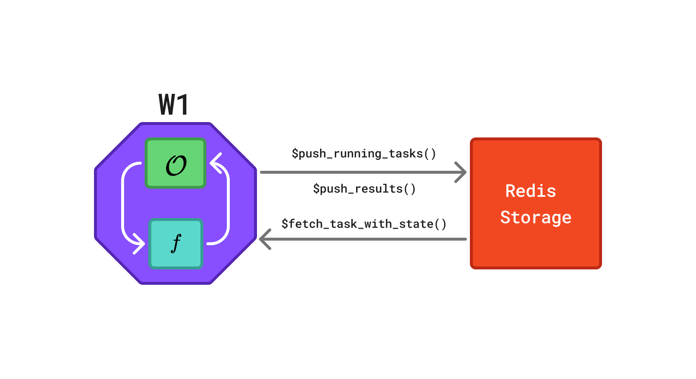
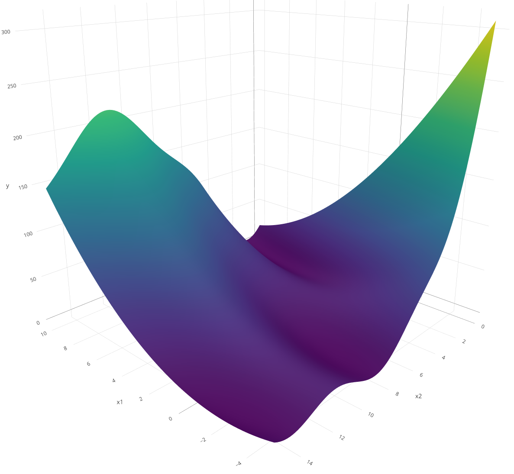

# rush - Asynchronous and Distributed Computing

`rush` is a package for asynchronous and decentralized optimization in
R. It uses a database-centric architecture in which workers communicate
through a shared Redis database, each independently executing its own
optimization loop. This vignette demonstrates the basic functionality of
`rush` through three examples of increasing complexity.

## General Structure

A `rush` network consists of multiple workers that communicate via a
shared `Redis` database. Each worker evaluates tasks and pushes the
corresponding results back to the database, as illustrated in
[Figure 1](#fig-worker-communication).



Figure 1: The communication flow between a worker and the `Redis`
database in a `rush` network. The octagon represents a worker and the
rectangle represents the `Redis` database. Each worker `W` runs its own
instance of the optimizer \\\mathcal{O}\\, evaluates the objective
function \\f\\, and exchanges task information via a shared `Redis`
database. Arrows indicate the flow of information: workers retrieve
completed tasks via `$fetch_finished_tasks()`, propose and store new
tasks via `$push_running_tasks()`, and report results via
`$finish_tasks()`.

## Random Search

We begin with a simple random search to illustrate the core concepts of
`rush`. Although random search does not require communication between
workers, it introduces the worker loop, tasks, and the manager.

We use the Branin function \\f\\ as the optimization target:

\\f(x_1,x_2)=\left(x_2-\frac{5.1}{4\pi^2}x_1^2+\frac{5}{\pi}x_1-6\right)^2
+10\left(1-\frac{1}{8\pi}\right)\cos(x_1)+10\\

The function is optimized over the domain \\x_1 \in \[-5, 10\]\\ and
\\x_2 \in \[0, 15\]\\. It is a commonly used benchmark function that is
fast to evaluate yet sufficiently nontrivial.

``` r

branin = function(x1, x2) {
  (x2 - 5.1 / (4 * pi^2) * x1^2 + 5 / pi * x1 - 6)^2 +
    10 * (1 - 1 / (8 * pi)) * cos(x1) +
    10
}
```



Branin function

### Worker Loop

We define the `worker_loop` function, which is executed by each worker.
The function repeatedly samples a random point, evaluates it using the
Branin function, and writes the result to the Redis database. It takes a
`RushWorker` object (`rush`) and the objective function `branin` as
arguments. The loop terminates after 100 tasks have been evaluated.

``` r

library(rush)

wl_random_search = function(rush, branin) {
  while (rush$n_finished_tasks < 100) {

    xs = list(x1 = runif(1, -5, 10), x2 = runif(1, 0, 15))
    key = rush$push_running_tasks(xss = list(xs))

    ys = list(y = branin(xs$x1, xs$x2))
    rush$finish_tasks(key, yss = list(ys))
  }
}
```

The worker loop relies on two principal methods. The
`$push_running_tasks()` method creates a new task in the database, marks
it as `"running"`, and returns a unique key identifying it. The
`$finish_tasks()` method takes this key along with the result and writes
it to the database, marking the task as `"finished"`. The
`$n_finished_tasks` field tracks the number of completed tasks and
serves as the termination criterion. Marking the task as `"running"`
before evaluation is not essential for random search, but is important
for algorithms that use the states of other workers’ tasks to inform the
next proposal.

### Tasks

Tasks are the basic units through which workers exchange information.
Each task consists of four components: a unique key, a computational
state, an input (`xs`), and an output (`ys`). The input and output are
lists that may contain arbitrary data. Tasks pass through one of four
computational states: `"running"`, `"finished"`, `"failed"`, and
`"queued"`. The `$push_running_tasks()` method creates tasks marked as
`"running"` and returns their keys. Upon completion, `$finish_tasks()`
marks tasks as `"finished"` and stores the associated results. Tasks
that encounter errors can be marked as `"failed"` using the
`$fail_tasks()` method. The fourth state, `"queued"`, supports a queue
mechanism described in [Section 4.1](#sec-queues).

### Manager

The `Rush` manager class is responsible for starting, monitoring, and
stopping workers within the network. It is initialized using the
[`rsh()`](https://rush.mlr-org.com/dev/reference/rsh.md) function, which
requires a network identifier and a `config` argument. The `config`
argument specifies a configuration file used to connect to the Redis
database via the `redux` package.

``` r

config = redux::redis_config()

rush = rsh(
  network = "example-random-search",
  config = config)
```

Workers are started using the `$start_workers()` method which accepts
the worker loop and the number of workers as arguments. Any additional
named arguments are forwarded to the worker loop function. The workers
run on `mirai` daemons which are started with the
[`mirai::daemons()`](https://mirai.r-lib.org/reference/daemons.html)
function.

``` r

mirai::daemons(4)

rush$start_workers(
  worker_loop = wl_random_search,
  n_workers = 4,
  branin = branin)

rush
```


    ── <Rush> ──────────────────────────────────────────────────────────────────────
    • Running Workers: 0
    • Queued Tasks: 0
    • Running Tasks: 0
    • Finished Tasks: 0
    • Failed Tasks: 0

Once the optimization completes, the results can be retrieved from the
database. The `$fetch_finished_tasks()` method returns a `data.table`
containing the task key, input, and result. The `worker_id` column
identifies the worker that evaluated the task. Further auxiliary
information can be passed to `$push_running_tasks()` and
`$finish_tasks()` via the `extra` argument.

``` r

rush$fetch_finished_tasks()[order(y)]
```

             worker_id        x1         x2          y          keys
                <char>     <num>      <num>      <num>        <char>
      1: disregardf...  3.029573  3.5499180   1.864517 df7292dc-3...
      2: disregardf...  8.961395  2.7941672   1.876007 ede34179-0...
      3: trusting_b...  2.793601  1.4543061   2.200494 d7f58177-f...
      4: horrified_... -3.554471 12.2905496   2.202194 34b6dff5-6...
      5: horrified_...  3.027632  1.0323480   2.237603 d3333be2-1...
     ---
     98: targeted_j...  6.769414 13.5328025 171.921655 919562ca-b...
     99: horrified_...  6.538174 13.8972295 182.638277 e77d16ed-7...
    100: disregardf...  7.218623 14.3914525 188.585119 0de7aed3-0...
    101: trusting_b... -3.827366  0.1496071 193.954405 c5ae4053-b...
    102: targeted_j... -4.866326  1.8211984 235.963588 1eda31cc-5...

Printing the `rush` object displays the number of running workers and
the number of tasks in each state.

``` r

rush
```


    ── <Rush> ──────────────────────────────────────────────────────────────────────
    • Running Workers: 0
    • Queued Tasks: 0
    • Running Tasks: 0
    • Finished Tasks: 102
    • Failed Tasks: 0

> **Note**
>
> The total of tasks slightly exceeds 100 because workers check the
> stopping condition independently: if multiple workers evaluate the
> condition concurrently — for example, when 99 tasks are finished —
> each may create a new task before detecting that the limit has been
> reached.

The workers can be stopped and the database reset using the `$reset()`
method.

``` r

rush$reset()

rush
```


    ── <Rush> ──────────────────────────────────────────────────────────────────────
    • Running Workers: 0
    • Queued Tasks: 0
    • Running Tasks: 0
    • Finished Tasks: 0
    • Failed Tasks: 0

## Median Stopping Rule

Random search evaluates configurations independently and requires no
communication between workers. We next demonstrate a more sophisticated
algorithm in which workers share intermediate results to make early
stopping decisions. We tune an XGBoost model on the `mtcars` dataset
using the median stopping rule: a configuration is abandoned if its
performance at a given training iteration falls below the median of all
completed evaluations at the same iteration.

### Worker Loop

Each worker samples a random hyperparameter configuration and trains the
model incrementally from 5 to 20 boosting rounds. After each round, the
worker fetches all completed tasks and compares its RMSE against the
median RMSE at the same iteration. If performance falls below the
median, the worker discards the configuration and starts a new one. The
loop terminates once 1000 evaluations have been recorded.

``` r

wl_median_stopping = function(rush, training_ids, test_ids, mtcars_data, response) {
  while (rush$n_finished_tasks < 1000) {
    params = list(
      max_depth = sample(1:20, 1),
      lambda = runif(1, 0, 1),
      alpha = runif(1, 0, 1)
    )

    model = NULL
    for (iteration in seq(5, 20)) {

      key = rush$push_running_tasks(xss = list(c(params, list(nrounds = iteration))))

      model = xgboost::xgboost(
        data = as.matrix(mtcars_data[training_ids, ]),
        label = response[training_ids],
        nrounds = if (is.null(model)) 5 else 1,
        params = params,
        xgb_model = model,
        verbose = 0
      )

      pred = predict(model, as.matrix(mtcars_data[test_ids, ]))
      rmse = sqrt(mean((pred - response[test_ids])^2))

      rush$finish_tasks(key, yss = list(list(rmse = rmse)))

      tasks = rush$fetch_finished_tasks()
      ref = tasks[nrounds == iteration, rmse]
      if (length(ref) > 0 && rmse > median(ref)) break
    }
  }
}
```

We prepare the dataset, initialize the network, and start the workers.
The training and test splits are passed explicitly as arguments to the
worker loop.

``` r

data(mtcars)

training_ids = sample(seq_len(nrow(mtcars)), 20)
test_ids = setdiff(seq_len(nrow(mtcars)), training_ids)
mtcars_data = mtcars[, -1]
response = mtcars$mpg

config = redux::redis_config()

rush = rsh(
  network = "example-median-stopping",
  config = config)

mirai::daemons(4)

rush$start_workers(
  worker_loop = wl_median_stopping,
  n_workers = 4,
  training_ids = training_ids,
  test_ids = test_ids,
  mtcars_data = mtcars_data,
  response = response)
```

We fetch the finished tasks and sort them by the objective value.

``` r

rush$fetch_finished_tasks()[order(rmse)]
```

           worker_id max_depth    lambda     alpha nrounds     rmse          keys
              <char>     <int>     <num>     <num>   <int>    <num>        <char>
    1: noneducabl...         2 0.5772176 0.7806092       5 5.035005 64b0ea58-f...
    2: bairnish_m...        16 0.5804491 0.8846090       5 5.035005 517725ba-7...
    3: highborn_b...         5 0.4270721 0.1463166       5 5.035005 ecb54bf0-9...
    4: conclusion...        10 0.4550490 0.9480833       5 5.035005 06e774de-1...
    5: noneducabl...         2 0.5772176 0.7806092       6 6.792078 1b43ae87-b...
    6: bairnish_m...        16 0.5804491 0.8846090       6 6.792078 dc15baac-5...

We stop the workers and reset the database.

``` r

rush$reset()
```

## Bayesian Optimization

We implement Asynchronous Decentralized Bayesian Optimization (ADBO)
([Egelé et al. 2023](#ref-egele2023)) which demonstrates the use of
shared task information and the queue mechanism. ADBO runs sequential
Bayesian optimization on multiple workers in parallel. Each worker
maintains its own surrogate model and independently proposes the next
configuration by maximizing an upper confidence bound acquisition
function. To promote varying exploration–exploitation trade-offs across
workers, the \\\lambda\\ parameter of the acquisition function is
sampled independently for each worker. When a worker completes an
evaluation, it shares the result via the database; other workers
incorporate this information into their local surrogate models on the
next iteration.

### Queues

While the typical task lifecycle in rush is running to finished, the
package also supports a queue mechanism for cases in which tasks are
created centrally and distributed to workers. We initialize the rush
network and push an initial Latin hypercube sampling (LHS) design to the
queue. Structured designs such as LHS can outperform random designs, but
generating them requires a global view of the design space. A queue
avoids redundant evaluations: the design is generated once in the main
process, and workers draw tasks from the shared queue.

``` r

config = redux::redis_config()

rush = rsh(
  network = "example-bayesian-optimization",
  config = config)
```

``` r

lhs_points = lhs::maximinLHS(n = 25, k = 2)
x1_lower = -5
x1_range = 15
x2_lower = 0
x2_range = 15

xss = lapply(1:25, function(i) {
  # rescale to the domain
  list(x1 = lhs_points[i, 1] * x1_range + x1_lower, x2 = lhs_points[i, 2] * x2_range + x2_lower)
})

rush$push_tasks(xss = xss)

rush
```


    ── <Rush> ──────────────────────────────────────────────────────────────────────
    • Running Workers: 0
    • Queued Tasks: 25
    • Running Tasks: 0
    • Finished Tasks: 0
    • Failed Tasks: 0

### Worker Loop

The worker loop first drains the initial design queue using the
`$pop_task()` method, which retrieves the next queued task, marks it as
`"running"`, and returns it. If the queue is empty, `$pop_task()`
returns `NULL`, signaling the transition to the model-based optimization
phase.

``` r

wl_bayesian_optimization = function(rush, branin) {
  repeat {
    task = rush$pop_task()
    if (is.null(task)) break
    ys = list(y = branin(task$xs$x1, task$xs$x2))
    rush$finish_tasks(task$key, yss = list(ys))
  }

  lambda = runif(1, 0.01, 10)

  while (rush$n_finished_tasks < 100) {

    archive = rush$fetch_tasks_with_state(states = c("running", "finished"))
    mean_y = mean(archive$y, na.rm = TRUE)
    archive["running", y := mean_y, on = "state"]

    surrogate = ranger::ranger(
      y ~ x1 + x2,
      data = archive,
      num.trees = 100L,
      keep.inbag = TRUE)

    xdt = data.table::data.table(x1 = runif(1000, -5, 10), x2 = runif(1000, 0, 15))
    p = predict(surrogate, xdt, type = "se", se.method = "jack")
    cb = p$predictions - lambda * p$se
    xs = as.list(xdt[which.min(cb)])

    key = rush$push_running_tasks(xss = list(xs))
    ys = list(y = branin(xs$x1, xs$x2))
    rush$finish_tasks(key, yss = list(ys))
  }
}
```

The `$fetch_tasks_with_state()` method retrieves all tasks in the
specified states from the database, returning a `data.table` containing
task states, keys, inputs, and results. Using
`$fetch_tasks_with_state()` rather than separate calls to
`$fetch_running_tasks()` and `$fetch_finished_tasks()` prevents tasks
from appearing twice if a state transition occurs during the fetch.

We start four workers and wait for the optimization to complete.

``` r

mirai::daemons(4)

rush$start_workers(
  worker_loop = wl_bayesian_optimization,
  n_workers = 4,
  branin = branin)
```

``` r

rush$fetch_finished_tasks()[order(y)]
```

             worker_id        x1          x2          y          keys
                <char>     <num>       <num>      <num>        <char>
      1: nonliteral...  8.842239  1.98233979   1.983614 a74b5647-5...
      2: checkable_...  8.687982  0.98972382   3.760611 d1bdca8a-5...
      3: nonliteral...  9.800043  1.11463348   3.939464 2f744345-e...
      4: checkable_... -4.035503 14.62361028   3.994970 d6af3506-9...
      5: discretion...  3.621236  0.13064937   4.721452 36428451-d...
     ---
     99: nonliteral... -4.378251  0.96088130 216.627679 e65092ce-0...
    100: discretion... -4.209761  0.28192977 221.685918 f45b612c-0...
    101: discretion... -4.147356  0.01248741 224.202994 1ac221a3-7...
    102: insistent_... -4.928725  1.91523650 239.083606 fbaa7b2a-a...
    103: discretion... -4.672349  0.00135402 273.844789 765aefa9-f...

Egelé, Romain, Isabelle Guyon, Venkatram Vishwanath, and Prasanna
Balaprakash. 2023. “Asynchronous Decentralized Bayesian Optimization for
Large Scale Hyperparameter Optimization.” *2023 IEEE 19th International
Conference on e-Science (e-Science)*, 1–10.
